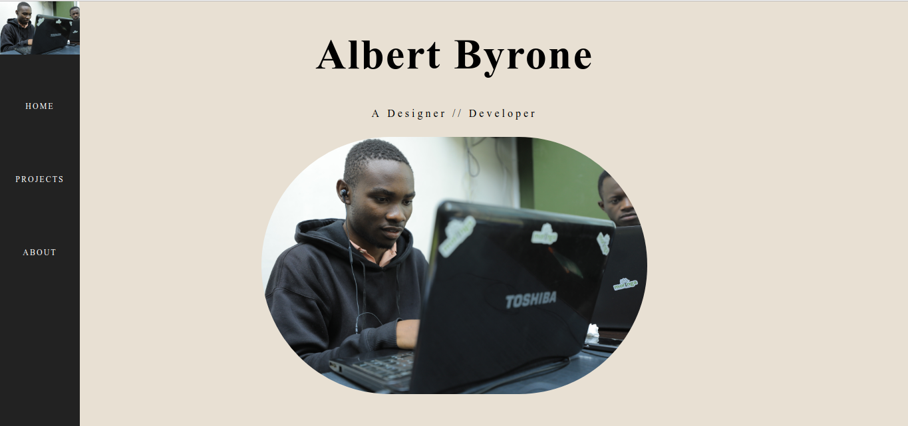

# Portfolio

##### By Albert Byrone 

### It is a description of my resume.

## Table of Content

+ [Description](#description)
+ [Installation Requirement](#Installation)
+ [Technology Used](#technology-used)
+ [Reference](#reference)
+ [Licence](#licence)
+ [Authors Info](#author-Info)

## Description

This is  a website that shows my portfolio/resume.It contains all my background information,some sample projects that I have worked on and the experience gained.

## Installation

### Requirements

* Either a computer,phone,tablet or an Ipad

* An access to the Internet

### Installation Process
****
Click on the link provided bellow to view the site.
https://albert-byrone.github.io/portfolio/
****
[Go Back to the top](#portfolio)
## Technology Used
* HTNL - which was used to build the structure of the pages.

* CSS - which was used to style the pages incuding the left aside navigation bar

## Reference
* Materialize CSS

[Go Back to the top](#portfolio)

## Licence

MIT License

Copyright (c) [2019] [Albert Byrone]

Permission is hereby granted, free of charge, to any person obtaining a copy
of this software and associated documentation files (the "Software"), to deal
in the Software without restriction, including without limitation the rights
to use, copy, modify, merge, publish, distribute, sublicense, and/or sell
copies of the Software, and to permit persons to whom the Software is
furnished to do so, subject to the following conditions:

The above copyright notice and this permission notice shall be included in all
copies or substantial portions of the Software.

THE SOFTWARE IS PROVIDED "AS IS", WITHOUT WARRANTY OF ANY KIND, EXPRESS OR
IMPLIED, INCLUDING BUT NOT LIMITED TO THE WARRANTIES OF MERCHANTABILITY,
FITNESS FOR A PARTICULAR PURPOSE AND NONINFRINGEMENT. IN NO EVENT SHALL THE
AUTHORS OR COPYRIGHT HOLDERS BE LIABLE FOR ANY CLAIM, DAMAGES OR OTHER
LIABILITY, WHETHER IN AN ACTION OF CONTRACT, TORT OR OTHERWISE, ARISING FROM,
OUT OF OR IN CONNECTION WITH THE SOFTWARE OR THE USE OR OTHER DEALINGS IN THE
SOFTWARE.

[Go Back to the top](#portfolio)

## Authors Info

Slack Profile - [Albert Byrone](https://app.slack.com/client/T077KKCG6/GLRQR61NW/user_profile/UKXCHMCNP?cdn_fallback=1)

Linked - [Albert Byrone](https://www.linkedin.com/in/albert-byrone-664811144/)

[Go Back to the top](#portfolio)